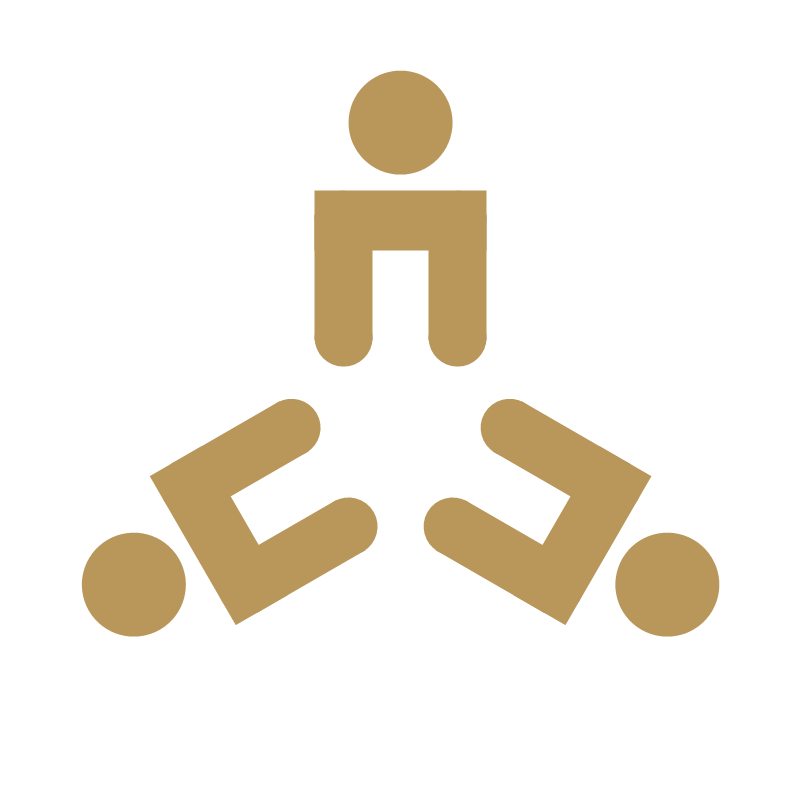

  
  

  <h1>Mohammed Laidi</h1>
  <h3>🚀 Cybersecurity Student • Freelancer • Founder of Cogito</h3>
  
  

    
    
    
  

  <!-- Social Links -->
  

    
    
    
    
  

---

### 👨‍💻 About Me

- 🎓 Cybersecurity Student at University Oran 1 Ahmed Ben Bella — focused on offensive & defensive security, networks, and AI-driven threat detection  
- 💼 Freelancer delivering real-world solutions in cybersecurity, web development & AI  
- 🚀 Founder & Owner of Cogito — building innovative tech solutions  
- 📜 Holder of a براءة اختراع (official patent)  
- 🏅 11+ Official Diplomas & Professional Formations in:
  - Artificial Intelligence  
  - Data Science  
  - Cybersecurity  
  - Networks (Réseaux)  

> Passionate about turning knowledge into real impact — from penetration testing to intelligent systems.

---

### 🔥 My Skills

  <!-- Core Security -->
  
  
  
  
  
  
  <!-- Languages -->
  
  
  
  
  
  <!-- Tools & More -->
  
  
  
  

---

### 🏆 Highlights

| Area | Achievement |
|------|-------------|
| Startup | Founder & Owner of Cogito |
| Innovation | Official Patent Holder (براءة اختراع) |
| Education | 11+ Official Diplomas & Formations |
| Focus | Cybersecurity + AI + Data Science + Networks |
| Status | Student + Active Freelancer |

---

### 🚀 Cogito — My Startup

  
   
  

- 🧠 **What is Cogito?** Innovative tech startup building secure, intelligent solutions at the intersection of cybersecurity, AI, and data science.
- 🎯 **Mission:** Turning knowledge into real impact — from penetration testing to intelligent systems.
- 💼 **Services:** Cybersecurity consulting, web development, AI solutions.
- 📩 **Contact / Collaborations:** Reach out via [LinkedIn](https://www.linkedin.com/in/mohammed-laidi-30ba7529a) or [Instagram](https://www.instagram.com/mohammed_ld_4) for startup, freelance, or research discussions.

> Cogito logo — three figures in a triangle, symbolizing collaboration and collective intelligence.

---

### 📫 Let's Connect

I'm always open to collaborations, freelance projects, research, or startup discussions.

- LinkedIn → [mohammed-laidi](https://www.linkedin.com/in/mohammed-laidi-30ba7529a)  
- Instagram → [@mohammed_ld_4](https://www.instagram.com/mohammed_ld_4)  
- X (Twitter) → [@mohamed_ld_42](https://x.com/mohamed_ld_42)

---

  
  

  <i>"Building secure, intelligent systems — one project at a time."</i>

